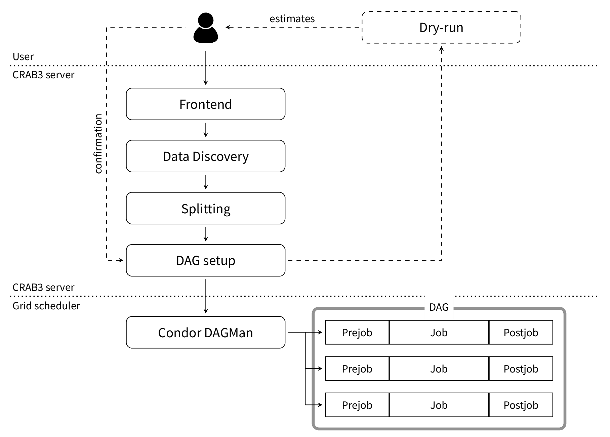
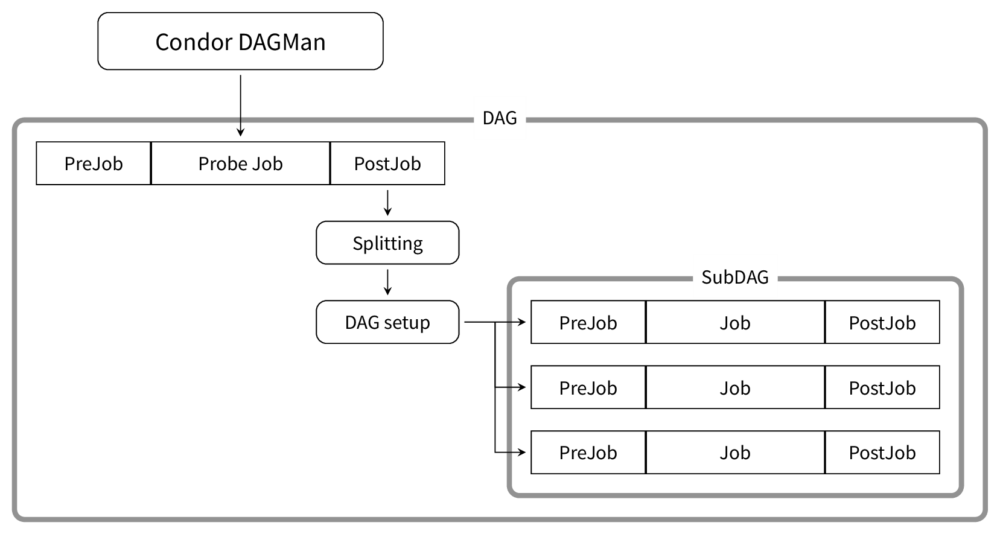

# Diagrams for various processing flows in CRAB3

Used to explain the evolution of Automatic splitting in CRAB3…

The general handling of a task in CRAB3, from user submission to handling
on the server, and processing via the schedd:

A first implementation of automatic splitting, with a single probe and
processing done via a dependent SubDAG:

Latest implementation of the automatic splitting, using several probe jobs
and a few tail DAGs to catch unprocessed data:

